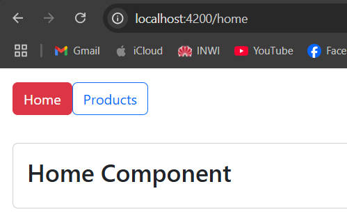
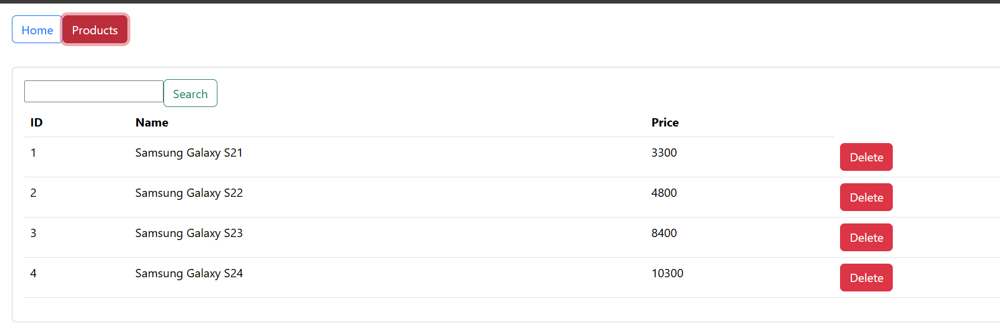
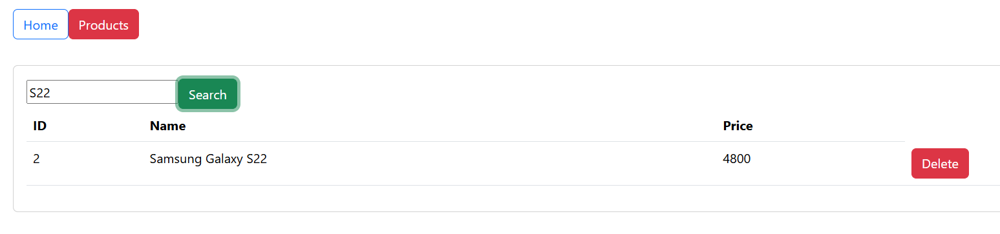
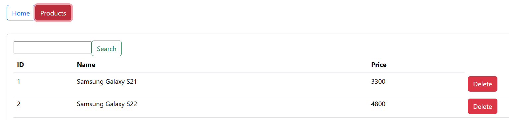

<h1>Gestion des Produits avec Angular</h1>

Ce projet est une démonstration pour découvrir Angular.

<h2>Page Home</h2>

<h2>Page des Produits</h2>
<h3>Affichage de tous les Produits</h3>

<h3>Recherche d'un produit</h3>

<h3>Suppression d'un produit</h3>

<h3>Auteur</h3>

Auteur : Med Amine Rizki

